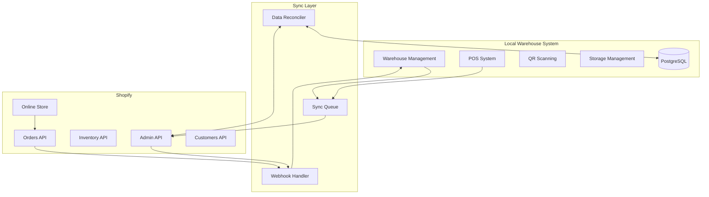
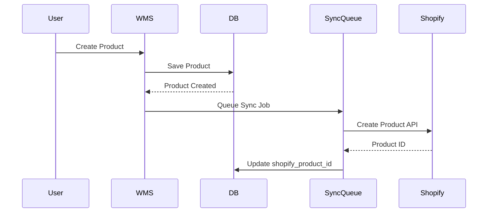
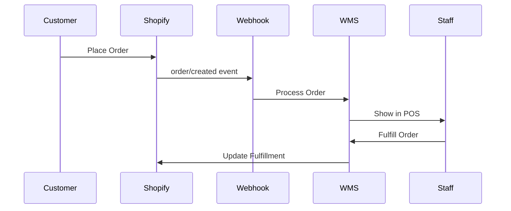
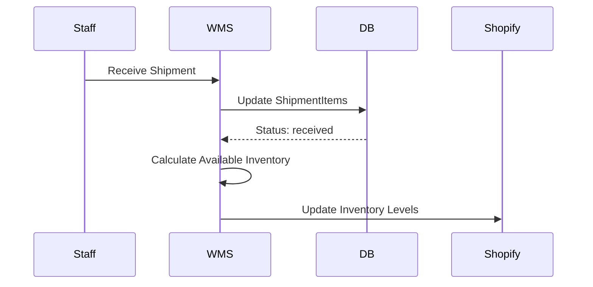

# Shopify Integration Guide

## Overview

This guide outlines the integration architecture between our Warehouse Management System (WMS) and Shopify, enabling e-commerce capabilities while maintaining local warehouse operations and POS functionality.

### Integration Goals

- **Use Shopify as E-commerce Frontend**: Leverage Shopify's robust online selling capabilities
- **Maintain Local POS System**: Avoid Shopify POS costs by using our existing system
- **Preserve Warehouse Operations**: Keep QR scanning, storage management, and shipment tracking local
- **Ensure Data Consistency**: Bidirectional sync with clear ownership boundaries
- **Optimize Performance**: Minimize sync latency and prevent overselling

## System Architecture



## Data Flow Patterns

### 1. Product Creation Flow



### 2. Order Processing Flow



### 3. Inventory Sync Flow



## Integration Patterns

### Event-Driven Architecture

We use an event-driven approach for real-time synchronization:

1. **Webhook Events**: Subscribe to Shopify webhooks for immediate updates
2. **Queue Processing**: Use async queues to handle API rate limits
3. **Event Sourcing**: Log all sync events for audit and recovery

### Sync Strategies

| Operation | Direction | Timing | Method |
|-----------|-----------|---------|---------|
| Product Creation | WMS → Shopify | Real-time | API Call after DB commit |
| Product Updates | WMS → Shopify | Real-time | Queued API Call |
| Inventory Changes | WMS → Shopify | Real-time | Batch API Call |
| Order Creation | Shopify → WMS | Real-time | Webhook |
| Customer Creation | Bidirectional | Real-time | Webhook + API |
| Price Updates | WMS → Shopify | Real-time | API Call |
| Fulfillment | WMS → Shopify | Real-time | API Call |

### Data Ownership Matrix

| Entity | Source of Truth | Sync Direction | Notes |
|--------|----------------|----------------|-------|
| Product Catalog | Shared | Bidirectional | WMS owns physical attributes, Shopify owns marketing content |
| Inventory Levels | WMS | WMS → Shopify | Based on ShipmentItems with status: received |
| Orders | Shopify | Shopify → WMS | Created in Shopify, fulfilled locally |
| Customers | Shared | Bidirectional | Merged based on phone/email |
| Pricing | WMS | WMS → Shopify | Price updates from POS |
| Storage Locations | WMS | None | Local only |
| QR Codes | WMS | None | Local only |
| Shipment Receipts | WMS | None | Local only |

## Key Integration Components

### 1. Shopify API Client

Located at: `/src/lib/shopify-client.ts` (to be created)

```typescript
class ShopifyClient {
  // Rate limiting
  private rateLimiter: RateLimiter;
  
  // Core methods
  async createProduct(product: LocalProduct): Promise<ShopifyProduct>;
  async updateInventory(sku: string, quantity: number): Promise<void>;
  async createFulfillment(orderId: string, items: FulfillmentItem[]): Promise<void>;
}
```

### 2. Webhook Handler

Located at: `/src/app/api/webhooks/shopify/route.ts` (to be created)

Handles:
- `orders/create`
- `orders/cancelled`
- `customers/create`
- `customers/update`
- `products/update`

### 3. Sync Queue Processor

Located at: `/src/lib/sync-queue.ts` (to be created)

Features:
- Retry logic with exponential backoff
- Dead letter queue for failed syncs
- Batch processing for efficiency
- Priority queues for critical operations

### 4. Data Reconciler

Located at: `/src/lib/reconciler.ts` (to be created)

Runs periodic jobs to:
- Compare inventory levels
- Verify order statuses
- Merge duplicate customers
- Audit sync logs

## Configuration

### Environment Variables

```env
# Shopify Configuration
SHOPIFY_SHOP_DOMAIN=your-shop.myshopify.com
SHOPIFY_ADMIN_ACCESS_TOKEN=shpat_xxxxx
SHOPIFY_WEBHOOK_SECRET=xxxxx
SHOPIFY_API_VERSION=2024-01

# Sync Configuration
SYNC_BATCH_SIZE=50
SYNC_RETRY_ATTEMPTS=3
SYNC_RETRY_DELAY_MS=1000
INVENTORY_RECONCILE_INTERVAL_MINUTES=15
```

### Database Schema Extensions

Required fields to add:

```sql
-- Products table
ALTER TABLE products ADD COLUMN shopify_product_id VARCHAR(255);
ALTER TABLE products ADD COLUMN shopify_variant_id VARCHAR(255);
ALTER TABLE products ADD COLUMN sku VARCHAR(255) UNIQUE;
ALTER TABLE products ADD COLUMN barcode VARCHAR(255);
ALTER TABLE products ADD COLUMN last_synced_at TIMESTAMP;
ALTER TABLE products ADD COLUMN sync_status VARCHAR(50);

-- Customers table
ALTER TABLE customers ADD COLUMN shopify_customer_id VARCHAR(255);
ALTER TABLE customers ADD COLUMN email VARCHAR(255);
ALTER TABLE customers ADD COLUMN last_synced_at TIMESTAMP;

-- Orders table
ALTER TABLE orders ADD COLUMN shopify_order_id VARCHAR(255);
ALTER TABLE orders ADD COLUMN shopify_order_number VARCHAR(255);
ALTER TABLE orders ADD COLUMN fulfillment_status VARCHAR(50);
ALTER TABLE orders ADD COLUMN financial_status VARCHAR(50);

-- Sync logs table (new)
CREATE TABLE sync_logs (
  id SERIAL PRIMARY KEY,
  entity_type VARCHAR(50),
  entity_id VARCHAR(255),
  operation VARCHAR(50),
  status VARCHAR(50),
  error_message TEXT,
  created_at TIMESTAMP DEFAULT NOW()
);
```

## Critical Considerations

### 1. Preventing Overselling

```typescript
// Reserve inventory before confirming Shopify order
async function processShopifyOrder(order: ShopifyOrder) {
  const transaction = await db.transaction();
  try {
    // 1. Reserve inventory locally
    await reserveInventory(order.line_items, transaction);
    
    // 2. Confirm order in Shopify
    await shopify.confirmOrder(order.id);
    
    // 3. Commit transaction
    await transaction.commit();
  } catch (error) {
    await transaction.rollback();
    await shopify.cancelOrder(order.id);
    throw error;
  }
}
```

### 2. Handling Network Failures

```typescript
// Implement idempotent operations
async function syncProductToShopify(product: Product) {
  const syncLog = await findSyncLog(product.id, 'product_create');
  
  if (syncLog?.status === 'completed') {
    return syncLog.shopify_id; // Already synced
  }
  
  try {
    const shopifyProduct = await shopify.createProduct(product);
    await recordSyncSuccess(product.id, shopifyProduct.id);
    return shopifyProduct.id;
  } catch (error) {
    await recordSyncFailure(product.id, error);
    throw error;
  }
}
```

### 3. Rate Limit Management

```typescript
// Use token bucket algorithm
class RateLimiter {
  private tokens = 40; // Shopify allows 40/minute
  private lastRefill = Date.now();
  
  async acquire() {
    await this.refillTokens();
    
    if (this.tokens <= 0) {
      const waitTime = 60000 - (Date.now() - this.lastRefill);
      await sleep(waitTime);
      await this.refillTokens();
    }
    
    this.tokens--;
  }
  
  private async refillTokens() {
    const now = Date.now();
    const timePassed = now - this.lastRefill;
    const tokensToAdd = Math.floor(timePassed / 1500); // 40 per minute
    
    this.tokens = Math.min(40, this.tokens + tokensToAdd);
    this.lastRefill = now;
  }
}
```

## Monitoring and Alerting

### Key Metrics to Track

1. **Sync Latency**: Time between local change and Shopify update
2. **Sync Success Rate**: Percentage of successful sync operations
3. **Inventory Discrepancies**: Differences found during reconciliation
4. **Webhook Processing Time**: Time to process incoming webhooks
5. **API Rate Limit Usage**: Current usage vs limits

### Alert Conditions

- Sync failure rate > 5%
- Inventory discrepancy > 0 after reconciliation
- Webhook processing queue > 100 items
- API rate limit usage > 80%
- Any sync operation failing > 3 times

## Security Considerations

### API Key Management

- Store API keys in environment variables
- Use separate keys for development and production
- Rotate keys regularly
- Never commit keys to version control

### Webhook Verification

```typescript
// Verify webhook authenticity
function verifyWebhook(rawBody: string, signature: string): boolean {
  const hash = crypto
    .createHmac('sha256', process.env.SHOPIFY_WEBHOOK_SECRET)
    .update(rawBody, 'utf8')
    .digest('base64');
  
  return hash === signature;
}
```

### Data Privacy

- Encrypt sensitive customer data
- Comply with GDPR/CCPA requirements
- Implement audit logging for all data access
- Use HTTPS for all API communications

## Next Steps

1. Review the [Schema Migration Guide](./shopify-schema-migration.md) for database changes
2. Follow the [Developer Guide](./shopify-developer-guide.md) for implementation
3. Configure sync strategies using the [Sync Strategy Documentation](./shopify-sync-strategy.md)
4. Set up API integration with the [API Reference](./shopify-api-reference.md)
5. Prepare for issues using the [Troubleshooting Guide](./shopify-troubleshooting.md)

## Support and Resources

- [Shopify Admin API Documentation](https://shopify.dev/docs/admin-api)
- [Shopify Webhook Documentation](https://shopify.dev/docs/admin-api/rest/reference/events/webhook)
- [Rate Limiting Guide](https://shopify.dev/docs/admin-api/rest/reference/rate-limits)
- Internal Support: Contact the development team for assistance