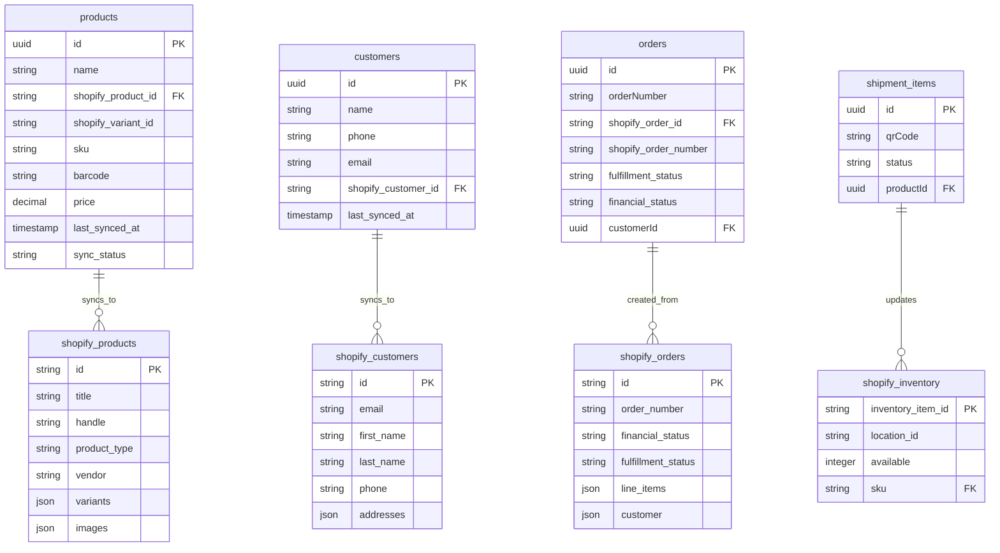

# Shopify Schema Migration Guide

## Overview

This guide details the database schema changes required to integrate with Shopify, including entity mappings, data transformations, and migration scripts.

## Entity Relationship Diagram



## Detailed Entity Mappings

### 1. Products Mapping

| Local Field | Shopify Field | Transformation | Notes |
|-------------|---------------|----------------|-------|
| `id` | - | None | Internal use only |
| `name` | `title` | Direct | Product display name |
| `brand.name` | `vendor` | Join with brands table | Brand relationship |
| `model` | `product_type` | Direct | Product categorization |
| `qrCode` | `barcode` | Direct | For POS scanning |
| `description` | `body_html` | HTML encoding | Rich text description |
| `category` | `tags` | Array transformation | Comma-separated to array |
| `price` | `variants[0].price` | Decimal to string | Price per variant |
| `weight` | `variants[0].weight` | Convert to grams | Shopify uses grams |
| `size` | `metafields` | Custom metafield | Store as dimension metafield |
| `color` | `options[0]` | Create variant option | Color as variant differentiator |
| - | `sku` | Generate | Create from brand + model |
| - | `inventory_quantity` | Calculate | Count of received items |
| - | `images` | - | To be added later |

#### Product Schema Extension

```sql
-- Add Shopify-specific columns to products table
ALTER TABLE products 
ADD COLUMN shopify_product_id VARCHAR(255),
ADD COLUMN shopify_variant_id VARCHAR(255),
ADD COLUMN sku VARCHAR(255) UNIQUE,
ADD COLUMN barcode VARCHAR(255),
ADD COLUMN sync_status VARCHAR(50) DEFAULT 'pending',
ADD COLUMN last_synced_at TIMESTAMP,
ADD COLUMN shopify_inventory_item_id VARCHAR(255),
ADD COLUMN compare_at_price DECIMAL(10,2),
ADD COLUMN cost_per_item DECIMAL(10,2),
ADD COLUMN requires_shipping BOOLEAN DEFAULT true,
ADD COLUMN taxable BOOLEAN DEFAULT true,
ADD COLUMN weight_unit VARCHAR(10) DEFAULT 'g',
ADD INDEX idx_shopify_product_id (shopify_product_id),
ADD INDEX idx_sku (sku),
ADD INDEX idx_sync_status (sync_status);

-- Create product metafields table for additional Shopify data
CREATE TABLE product_metafields (
  id UUID PRIMARY KEY DEFAULT gen_random_uuid(),
  product_id UUID REFERENCES products(id) ON DELETE CASCADE,
  namespace VARCHAR(255) NOT NULL,
  key VARCHAR(255) NOT NULL,
  value TEXT,
  value_type VARCHAR(50) DEFAULT 'string',
  created_at TIMESTAMP DEFAULT NOW(),
  updated_at TIMESTAMP DEFAULT NOW(),
  UNIQUE KEY unique_metafield (product_id, namespace, key)
);
```

### 2. Customers Mapping

| Local Field | Shopify Field | Transformation | Notes |
|-------------|---------------|----------------|-------|
| `id` | - | None | Internal use only |
| `name` | `first_name` + `last_name` | Split by space | Parse Vietnamese names carefully |
| `phone` | `phone` | Format standardization | Add country code +84 |
| `address` | `addresses[0]` | Parse to components | Split into street, city, etc. |
| - | `email` | Generate or request | Required by Shopify |
| - | `accepts_marketing` | Default false | Marketing consent |
| - | `verified_email` | Default false | Email verification status |
| - | `tags` | Add "POS_Customer" | Identify POS customers |

#### Customer Schema Extension

```sql
-- Add Shopify-specific columns to customers table
ALTER TABLE customers
ADD COLUMN shopify_customer_id VARCHAR(255),
ADD COLUMN email VARCHAR(255),
ADD COLUMN first_name VARCHAR(255),
ADD COLUMN last_name VARCHAR(255),
ADD COLUMN accepts_marketing BOOLEAN DEFAULT false,
ADD COLUMN verified_email BOOLEAN DEFAULT false,
ADD COLUMN tags TEXT,
ADD COLUMN note TEXT,
ADD COLUMN total_spent DECIMAL(10,2) DEFAULT 0,
ADD COLUMN orders_count INTEGER DEFAULT 0,
ADD COLUMN last_order_date TIMESTAMP,
ADD COLUMN sync_status VARCHAR(50) DEFAULT 'pending',
ADD COLUMN last_synced_at TIMESTAMP,
ADD INDEX idx_shopify_customer_id (shopify_customer_id),
ADD INDEX idx_email (email),
ADD INDEX idx_phone (phone);

-- Create customer addresses table
CREATE TABLE customer_addresses (
  id UUID PRIMARY KEY DEFAULT gen_random_uuid(),
  customer_id UUID REFERENCES customers(id) ON DELETE CASCADE,
  shopify_address_id VARCHAR(255),
  address1 VARCHAR(255),
  address2 VARCHAR(255),
  city VARCHAR(255),
  province VARCHAR(255),
  country VARCHAR(2) DEFAULT 'VN',
  zip VARCHAR(20),
  phone VARCHAR(50),
  name VARCHAR(255),
  company VARCHAR(255),
  is_default BOOLEAN DEFAULT false,
  created_at TIMESTAMP DEFAULT NOW(),
  updated_at TIMESTAMP DEFAULT NOW()
);
```

### 3. Orders Mapping

| Local Field | Shopify Field | Transformation | Notes |
|-------------|---------------|----------------|-------|
| `id` | - | None | Internal use only |
| `orderNumber` | `name` | Format: #1001 | Shopify order name |
| `customerId` | `customer.id` | Lookup Shopify ID | Reference customer sync |
| `totalAmount` | `total_price` | Decimal to string | Include tax |
| `paymentMethod` | `gateway` | Map to gateway | cod → manual, card → external |
| `paymentStatus` | `financial_status` | Status mapping | See status mapping table |
| `voucherCode` | `discount_codes[0]` | Create discount | If voucher exists |
| - | `fulfillment_status` | Calculate | Based on shipment items |
| - | `line_items` | Transform from order_items | Product line items |
| - | `shipping_address` | From customer | Customer's default address |
| - | `billing_address` | From customer | Same as shipping for COD |

#### Order Schema Extension

```sql
-- Add Shopify-specific columns to orders table
ALTER TABLE orders
ADD COLUMN shopify_order_id VARCHAR(255),
ADD COLUMN shopify_order_number VARCHAR(255),
ADD COLUMN shopify_checkout_id VARCHAR(255),
ADD COLUMN fulfillment_status VARCHAR(50),
ADD COLUMN financial_status VARCHAR(50),
ADD COLUMN cancel_reason VARCHAR(255),
ADD COLUMN cancelled_at TIMESTAMP,
ADD COLUMN closed_at TIMESTAMP,
ADD COLUMN processed_at TIMESTAMP,
ADD COLUMN currency VARCHAR(3) DEFAULT 'VND',
ADD COLUMN subtotal_price DECIMAL(10,2),
ADD COLUMN total_tax DECIMAL(10,2),
ADD COLUMN total_discounts DECIMAL(10,2),
ADD COLUMN total_shipping DECIMAL(10,2),
ADD COLUMN tags TEXT,
ADD COLUMN note TEXT,
ADD COLUMN source_name VARCHAR(255) DEFAULT 'pos',
ADD COLUMN sync_status VARCHAR(50) DEFAULT 'pending',
ADD COLUMN last_synced_at TIMESTAMP,
ADD INDEX idx_shopify_order_id (shopify_order_id),
ADD INDEX idx_shopify_order_number (shopify_order_number),
ADD INDEX idx_fulfillment_status (fulfillment_status),
ADD INDEX idx_financial_status (financial_status);

-- Create order line items Shopify fields
ALTER TABLE order_items
ADD COLUMN shopify_line_item_id VARCHAR(255),
ADD COLUMN shopify_product_id VARCHAR(255),
ADD COLUMN shopify_variant_id VARCHAR(255),
ADD COLUMN variant_title VARCHAR(255),
ADD COLUMN sku VARCHAR(255),
ADD COLUMN vendor VARCHAR(255),
ADD COLUMN fulfillment_service VARCHAR(255) DEFAULT 'manual',
ADD COLUMN requires_shipping BOOLEAN DEFAULT true,
ADD COLUMN taxable BOOLEAN DEFAULT true,
ADD COLUMN gift_card BOOLEAN DEFAULT false,
ADD COLUMN fulfillable_quantity INTEGER,
ADD COLUMN fulfillment_status VARCHAR(50),
ADD COLUMN discount_amount DECIMAL(10,2) DEFAULT 0,
ADD COLUMN tax_amount DECIMAL(10,2) DEFAULT 0;

-- Create fulfillments table
CREATE TABLE fulfillments (
  id UUID PRIMARY KEY DEFAULT gen_random_uuid(),
  order_id UUID REFERENCES orders(id) ON DELETE CASCADE,
  shopify_fulfillment_id VARCHAR(255),
  shopify_order_id VARCHAR(255),
  status VARCHAR(50),
  tracking_company VARCHAR(255),
  tracking_number VARCHAR(255),
  tracking_urls TEXT,
  created_at TIMESTAMP DEFAULT NOW(),
  updated_at TIMESTAMP DEFAULT NOW(),
  INDEX idx_shopify_fulfillment_id (shopify_fulfillment_id)
);
```

### 4. Inventory Mapping

| Local Source | Shopify Field | Calculation | Notes |
|--------------|---------------|-------------|-------|
| ShipmentItems count | `available` | COUNT WHERE status='received' | Available inventory |
| Product.id | `inventory_item_id` | Via shopify_inventory_item_id | Inventory tracking |
| Single location | `location_id` | Configure in settings | Your warehouse location |
| ShipmentItems.status | - | Status-based calculation | Only 'received' items count |

#### Inventory Tracking Table

```sql
-- Create inventory sync tracking table
CREATE TABLE inventory_sync (
  id UUID PRIMARY KEY DEFAULT gen_random_uuid(),
  product_id UUID REFERENCES products(id) ON DELETE CASCADE,
  shopify_inventory_item_id VARCHAR(255),
  shopify_location_id VARCHAR(255),
  local_quantity INTEGER DEFAULT 0,
  shopify_quantity INTEGER DEFAULT 0,
  last_local_update TIMESTAMP,
  last_shopify_update TIMESTAMP,
  discrepancy INTEGER GENERATED ALWAYS AS (local_quantity - shopify_quantity) STORED,
  sync_status VARCHAR(50) DEFAULT 'pending',
  last_synced_at TIMESTAMP,
  created_at TIMESTAMP DEFAULT NOW(),
  updated_at TIMESTAMP DEFAULT NOW(),
  INDEX idx_discrepancy (discrepancy),
  INDEX idx_sync_status (sync_status)
);

-- Add inventory tracking to shipment_items
ALTER TABLE shipment_items
ADD COLUMN affects_inventory BOOLEAN DEFAULT true,
ADD COLUMN inventory_synced_at TIMESTAMP,
ADD COLUMN previous_status VARCHAR(50);
```

## Sync Status Management

### Sync Status Values

All synced entities will have a `sync_status` field with these possible values:

| Status | Description | Next Action |
|--------|-------------|-------------|
| `pending` | Awaiting initial sync | Queue for sync |
| `syncing` | Currently being synced | Wait for completion |
| `synced` | Successfully synced | Monitor for changes |
| `failed` | Sync failed | Retry with backoff |
| `conflict` | Data conflict detected | Manual resolution |
| `deleted` | Deleted in one system | Confirm deletion |

### Sync Logs Table

```sql
-- Create comprehensive sync logs table
CREATE TABLE sync_logs (
  id UUID PRIMARY KEY DEFAULT gen_random_uuid(),
  entity_type VARCHAR(50) NOT NULL, -- 'product', 'customer', 'order', 'inventory'
  entity_id UUID NOT NULL,
  local_id UUID,
  shopify_id VARCHAR(255),
  operation VARCHAR(50) NOT NULL, -- 'create', 'update', 'delete', 'sync'
  direction VARCHAR(20), -- 'to_shopify', 'from_shopify', 'bidirectional'
  status VARCHAR(50) NOT NULL, -- 'pending', 'processing', 'completed', 'failed'
  request_data JSONB,
  response_data JSONB,
  error_message TEXT,
  error_code VARCHAR(100),
  retry_count INTEGER DEFAULT 0,
  max_retries INTEGER DEFAULT 3,
  next_retry_at TIMESTAMP,
  started_at TIMESTAMP,
  completed_at TIMESTAMP,
  created_at TIMESTAMP DEFAULT NOW(),
  INDEX idx_entity (entity_type, entity_id),
  INDEX idx_status (status),
  INDEX idx_next_retry (next_retry_at),
  INDEX idx_created_at (created_at)
);

-- Create sync queue table for batch operations
CREATE TABLE sync_queue (
  id UUID PRIMARY KEY DEFAULT gen_random_uuid(),
  entity_type VARCHAR(50) NOT NULL,
  entity_id UUID NOT NULL,
  operation VARCHAR(50) NOT NULL,
  priority INTEGER DEFAULT 5, -- 1-10, 1 being highest
  payload JSONB,
  status VARCHAR(50) DEFAULT 'queued',
  attempts INTEGER DEFAULT 0,
  max_attempts INTEGER DEFAULT 3,
  scheduled_at TIMESTAMP DEFAULT NOW(),
  started_at TIMESTAMP,
  completed_at TIMESTAMP,
  error_message TEXT,
  created_at TIMESTAMP DEFAULT NOW(),
  INDEX idx_queue_status (status, scheduled_at),
  INDEX idx_priority (priority, scheduled_at)
);
```

## Data Transformation Functions

### Vietnamese Name Parser

```sql
-- Function to parse Vietnamese names
CREATE OR REPLACE FUNCTION parse_vietnamese_name(full_name TEXT)
RETURNS TABLE(first_name TEXT, last_name TEXT) AS $$
BEGIN
  -- Handle common Vietnamese name patterns
  -- Typically: Last Middle First (Nguyễn Văn A)
  RETURN QUERY
  SELECT 
    CASE 
      WHEN array_length(string_to_array(full_name, ' '), 1) >= 2 THEN
        (string_to_array(full_name, ' '))[array_length(string_to_array(full_name, ' '), 1)]
      ELSE full_name
    END AS first_name,
    CASE 
      WHEN array_length(string_to_array(full_name, ' '), 1) >= 2 THEN
        array_to_string(
          (string_to_array(full_name, ' '))[1:array_length(string_to_array(full_name, ' '), 1)-1], 
          ' '
        )
      ELSE ''
    END AS last_name;
END;
$$ LANGUAGE plpgsql;

-- Function to format phone numbers
CREATE OR REPLACE FUNCTION format_phone_for_shopify(phone TEXT)
RETURNS TEXT AS $$
BEGIN
  -- Remove all non-numeric characters
  phone := regexp_replace(phone, '[^0-9]', '', 'g');
  
  -- Add Vietnam country code if not present
  IF phone LIKE '0%' THEN
    phone := '+84' || substring(phone from 2);
  ELSIF phone NOT LIKE '+%' THEN
    phone := '+84' || phone;
  END IF;
  
  RETURN phone;
END;
$$ LANGUAGE plpgsql;

-- Function to generate SKU
CREATE OR REPLACE FUNCTION generate_sku(brand_code TEXT, model TEXT, color TEXT DEFAULT NULL)
RETURNS TEXT AS $$
BEGIN
  RETURN UPPER(
    CONCAT(
      COALESCE(LEFT(brand_code, 3), 'XXX'),
      '-',
      COALESCE(LEFT(regexp_replace(model, '[^A-Za-z0-9]', '', 'g'), 10), 'MODEL'),
      CASE WHEN color IS NOT NULL THEN '-' || LEFT(color, 3) ELSE '' END
    )
  );
END;
$$ LANGUAGE plpgsql;
```

## Migration Scripts

### Phase 1: Schema Updates

```sql
-- Migration: 001_add_shopify_fields.sql
BEGIN;

-- Products
ALTER TABLE products 
ADD COLUMN IF NOT EXISTS shopify_product_id VARCHAR(255),
ADD COLUMN IF NOT EXISTS shopify_variant_id VARCHAR(255),
ADD COLUMN IF NOT EXISTS sku VARCHAR(255),
ADD COLUMN IF NOT EXISTS barcode VARCHAR(255),
ADD COLUMN IF NOT EXISTS sync_status VARCHAR(50) DEFAULT 'pending',
ADD COLUMN IF NOT EXISTS last_synced_at TIMESTAMP;

-- Customers
ALTER TABLE customers
ADD COLUMN IF NOT EXISTS shopify_customer_id VARCHAR(255),
ADD COLUMN IF NOT EXISTS email VARCHAR(255),
ADD COLUMN IF NOT EXISTS first_name VARCHAR(255),
ADD COLUMN IF NOT EXISTS last_name VARCHAR(255),
ADD COLUMN IF NOT EXISTS sync_status VARCHAR(50) DEFAULT 'pending',
ADD COLUMN IF NOT EXISTS last_synced_at TIMESTAMP;

-- Orders
ALTER TABLE orders
ADD COLUMN IF NOT EXISTS shopify_order_id VARCHAR(255),
ADD COLUMN IF NOT EXISTS shopify_order_number VARCHAR(255),
ADD COLUMN IF NOT EXISTS fulfillment_status VARCHAR(50),
ADD COLUMN IF NOT EXISTS financial_status VARCHAR(50),
ADD COLUMN IF NOT EXISTS sync_status VARCHAR(50) DEFAULT 'pending',
ADD COLUMN IF NOT EXISTS last_synced_at TIMESTAMP;

COMMIT;
```

### Phase 2: Data Migration

```sql
-- Migration: 002_populate_shopify_fields.sql
BEGIN;

-- Generate SKUs for existing products
UPDATE products p
SET sku = generate_sku(
  (SELECT code FROM brands WHERE id = p.brand_id),
  p.model,
  p.color
)
WHERE sku IS NULL;

-- Use QR codes as barcodes
UPDATE products
SET barcode = qr_code
WHERE barcode IS NULL AND qr_code IS NOT NULL;

-- Parse customer names
UPDATE customers c
SET (first_name, last_name) = (
  SELECT first_name, last_name 
  FROM parse_vietnamese_name(c.name)
)
WHERE first_name IS NULL;

-- Format phone numbers
UPDATE customers
SET phone = format_phone_for_shopify(phone)
WHERE phone IS NOT NULL;

COMMIT;
```

### Phase 3: Create Indexes

```sql
-- Migration: 003_create_indexes.sql
BEGIN;

-- Products indexes
CREATE INDEX IF NOT EXISTS idx_products_shopify_id ON products(shopify_product_id);
CREATE INDEX IF NOT EXISTS idx_products_sku ON products(sku);
CREATE INDEX IF NOT EXISTS idx_products_sync_status ON products(sync_status);

-- Customers indexes
CREATE INDEX IF NOT EXISTS idx_customers_shopify_id ON customers(shopify_customer_id);
CREATE INDEX IF NOT EXISTS idx_customers_email ON customers(email);
CREATE INDEX IF NOT EXISTS idx_customers_phone ON customers(phone);

-- Orders indexes
CREATE INDEX IF NOT EXISTS idx_orders_shopify_id ON orders(shopify_order_id);
CREATE INDEX IF NOT EXISTS idx_orders_fulfillment ON orders(fulfillment_status);
CREATE INDEX IF NOT EXISTS idx_orders_financial ON orders(financial_status);

-- Sync logs indexes
CREATE INDEX IF NOT EXISTS idx_sync_logs_entity ON sync_logs(entity_type, entity_id);
CREATE INDEX IF NOT EXISTS idx_sync_logs_status ON sync_logs(status);
CREATE INDEX IF NOT EXISTS idx_sync_logs_retry ON sync_logs(next_retry_at) WHERE status = 'failed';

COMMIT;
```

## Status Mapping Tables

### Payment Status Mapping

| Local Status | Shopify Financial Status |
|--------------|-------------------------|
| `pending` | `pending` |
| `paid` | `paid` |
| `partial` | `partially_paid` |
| `refunded` | `refunded` |
| `failed` | `voided` |

### Order Status Mapping

| Local Status | Shopify Fulfillment Status |
|--------------|---------------------------|
| `pending` | `unfulfilled` |
| `processing` | `partial` |
| `shipped` | `fulfilled` |
| `delivered` | `fulfilled` |
| `cancelled` | `cancelled` |

## Validation Rules

### Pre-Sync Validation

```sql
-- Check for required fields before syncing
CREATE OR REPLACE FUNCTION validate_product_for_shopify(product_id UUID)
RETURNS BOOLEAN AS $$
DECLARE
  product_record RECORD;
BEGIN
  SELECT * INTO product_record FROM products WHERE id = product_id;
  
  -- Check required fields
  IF product_record.name IS NULL OR product_record.name = '' THEN
    RAISE NOTICE 'Product missing name';
    RETURN FALSE;
  END IF;
  
  IF product_record.sku IS NULL OR product_record.sku = '' THEN
    RAISE NOTICE 'Product missing SKU';
    RETURN FALSE;
  END IF;
  
  IF product_record.price IS NULL OR product_record.price <= 0 THEN
    RAISE NOTICE 'Product missing valid price';
    RETURN FALSE;
  END IF;
  
  RETURN TRUE;
END;
$$ LANGUAGE plpgsql;
```

## Rollback Procedures

### Emergency Rollback Script

```sql
-- Rollback: remove_shopify_integration.sql
BEGIN;

-- Remove Shopify-specific columns (keeping data for safety)
ALTER TABLE products 
  DROP COLUMN IF EXISTS shopify_product_id CASCADE,
  DROP COLUMN IF EXISTS shopify_variant_id CASCADE;

ALTER TABLE customers
  DROP COLUMN IF EXISTS shopify_customer_id CASCADE;

ALTER TABLE orders
  DROP COLUMN IF EXISTS shopify_order_id CASCADE,
  DROP COLUMN IF EXISTS shopify_order_number CASCADE;

-- Drop sync tables (after backing up)
DROP TABLE IF EXISTS sync_logs;
DROP TABLE IF EXISTS sync_queue;
DROP TABLE IF EXISTS inventory_sync;
DROP TABLE IF EXISTS fulfillments;
DROP TABLE IF EXISTS product_metafields;
DROP TABLE IF EXISTS customer_addresses;

-- Drop functions
DROP FUNCTION IF EXISTS parse_vietnamese_name;
DROP FUNCTION IF EXISTS format_phone_for_shopify;
DROP FUNCTION IF EXISTS generate_sku;
DROP FUNCTION IF EXISTS validate_product_for_shopify;

COMMIT;
```

## Next Steps

1. Run migration scripts in development environment
2. Test data transformations with sample data
3. Validate Vietnamese name parsing accuracy
4. Set up sync monitoring queries
5. Configure backup procedures before production migration

## Monitoring Queries

```sql
-- Check sync status distribution
SELECT 
  entity_type,
  sync_status,
  COUNT(*) as count
FROM (
  SELECT 'product' as entity_type, sync_status FROM products
  UNION ALL
  SELECT 'customer', sync_status FROM customers
  UNION ALL
  SELECT 'order', sync_status FROM orders
) combined
GROUP BY entity_type, sync_status
ORDER BY entity_type, sync_status;

-- Find items needing sync
SELECT * FROM products WHERE sync_status = 'pending' LIMIT 10;
SELECT * FROM customers WHERE sync_status = 'pending' LIMIT 10;
SELECT * FROM orders WHERE sync_status = 'pending' LIMIT 10;

-- Check for inventory discrepancies
SELECT 
  p.name,
  p.sku,
  i.local_quantity,
  i.shopify_quantity,
  i.discrepancy
FROM inventory_sync i
JOIN products p ON i.product_id = p.id
WHERE i.discrepancy != 0
ORDER BY ABS(i.discrepancy) DESC;

-- Recent sync failures
SELECT 
  entity_type,
  entity_id,
  error_message,
  retry_count,
  created_at
FROM sync_logs
WHERE status = 'failed'
  AND created_at > NOW() - INTERVAL '1 day'
ORDER BY created_at DESC
LIMIT 20;
```