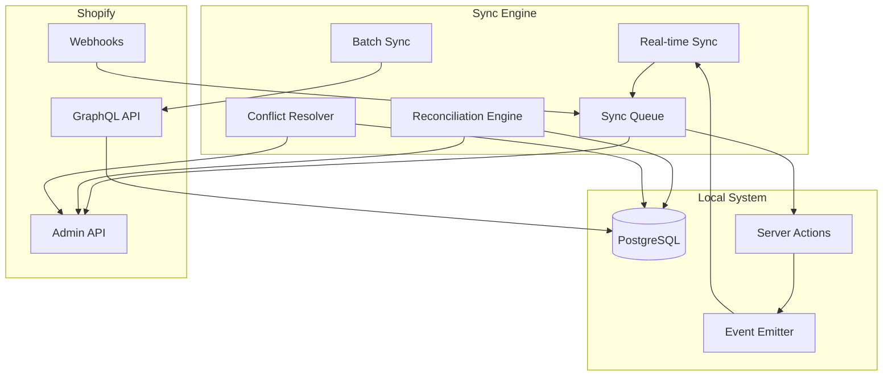

# Shopify Sync Strategy Documentation

## Overview

This document outlines the bidirectional synchronization strategy between our Warehouse Management System and Shopify, including real-time webhooks, batch processing, conflict resolution, and error handling.

## Sync Architecture



## Sync Strategies by Entity

### Products

| Aspect | Strategy | Implementation |
|--------|----------|----------------|
| **Direction** | Primarily Local → Shopify | Local system is source of truth |
| **Timing** | Real-time on create/update | Immediate sync after DB commit |
| **Batch Sync** | Daily at 2 AM | Full catalog reconciliation |
| **Conflict Resolution** | Local wins | Shopify changes are logged but not applied |
| **Fields Synced** | All product attributes | Except local-only fields (QR codes, storage) |

```typescript
// Product sync strategy
interface ProductSyncStrategy {
  // Real-time sync on these events
  events: ['product.created', 'product.updated', 'product.deleted'];
  
  // Batch sync schedule
  batch: {
    schedule: '0 2 * * *', // Daily at 2 AM
    method: 'full', // full | incremental
    batchSize: 50
  };
  
  // Conflict resolution
  conflictResolution: 'local_wins';
  
  // Retry strategy
  retry: {
    maxAttempts: 3,
    backoff: 'exponential',
    initialDelay: 1000
  };
}
```

### Inventory

| Aspect | Strategy | Implementation |
|--------|----------|----------------|
| **Direction** | Local → Shopify only | Warehouse is single source of truth |
| **Timing** | Real-time critical | Update within 5 seconds |
| **Batch Sync** | Every 15 minutes | Reconciliation and correction |
| **Conflict Resolution** | Always override Shopify | Force update Shopify levels |
| **Calculation** | Aggregate shipment items | COUNT(status='received') |

```typescript
// Inventory sync strategy
interface InventorySyncStrategy {
  // Real-time triggers
  triggers: [
    'shipment_item.received',    // Item marked as received
    'shipment_item.sold',        // Item sold
    'shipment_item.returned',    // Item returned to inventory
    'order.cancelled'            // Order cancelled, restore inventory
  ];
  
  // Aggregation logic
  calculation: {
    available: "COUNT(*) WHERE status = 'received'",
    reserved: "COUNT(*) WHERE status = 'reserved'",
    committed: "COUNT(*) WHERE status IN ('sold', 'shipped')"
  };
  
  // Batch reconciliation
  reconciliation: {
    schedule: '*/15 * * * *', // Every 15 minutes
    tolerance: 0, // Zero tolerance for discrepancies
    autoCorrect: true
  };
}
```

### Orders

| Aspect | Strategy | Implementation |
|--------|----------|----------------|
| **Direction** | Shopify → Local | Shopify creates, local fulfills |
| **Timing** | Webhook immediate | Process within 1 second |
| **Batch Sync** | Hourly | Catch missed webhooks |
| **Conflict Resolution** | Merge strategy | Combine data from both systems |
| **Fulfillment** | Local → Shopify | Update fulfillment status |

```typescript
// Order sync strategy
interface OrderSyncStrategy {
  // Webhook subscriptions
  webhooks: [
    'orders/create',
    'orders/updated',
    'orders/cancelled',
    'orders/fulfilled',
    'orders/paid'
  ];
  
  // Processing rules
  processing: {
    autoAccept: true, // Automatically accept Shopify orders
    reserveInventory: true, // Reserve items immediately
    validateInventory: true, // Check availability before accepting
  };
  
  // Fulfillment sync
  fulfillment: {
    direction: 'local_to_shopify',
    updateOn: ['packed', 'shipped', 'delivered'],
    includeTracking: true
  };
}
```

### Customers

| Aspect | Strategy | Implementation |
|--------|----------|----------------|
| **Direction** | Bidirectional | Merge from both sources |
| **Timing** | Real-time both ways | Immediate sync |
| **Batch Sync** | Daily | Deduplication and merge |
| **Conflict Resolution** | Merge strategy | Combine attributes |
| **Matching** | Phone + Email | Fuzzy matching for duplicates |

```typescript
// Customer sync strategy
interface CustomerSyncStrategy {
  // Bidirectional sync
  localEvents: ['customer.created', 'customer.updated'];
  shopifyWebhooks: ['customers/create', 'customers/update'];
  
  // Matching logic
  matching: {
    primaryKey: 'phone', // Primary matching field
    secondaryKey: 'email', // Secondary matching
    fuzzyMatch: true, // Allow slight variations
  };
  
  // Merge strategy
  mergeRules: {
    name: 'prefer_local', // Local name preferred
    email: 'prefer_shopify', // Shopify email preferred
    phone: 'prefer_local', // Local phone preferred
    address: 'merge_all', // Keep all addresses
  };
  
  // Deduplication
  deduplication: {
    schedule: '0 3 * * *', // Daily at 3 AM
    strategy: 'merge', // merge | keep_newest | keep_oldest
  };
}
```

## Real-time Sync Implementation

### Event-Driven Architecture

```typescript
// Event emitter for local changes
class SyncEventEmitter extends EventEmitter {
  async emitProductChange(product: Product, operation: 'create' | 'update' | 'delete') {
    const event: SyncEvent = {
      id: generateEventId(),
      timestamp: new Date(),
      entity: 'product',
      entityId: product.id,
      operation,
      data: product,
      priority: this.calculatePriority(operation)
    };
    
    // Emit to sync queue
    await this.queueSync(event);
    
    // Log event
    await this.logEvent(event);
  }
  
  private calculatePriority(operation: string): number {
    const priorities = {
      'delete': 1,  // Highest priority
      'create': 5,  // Medium priority
      'update': 7   // Lower priority
    };
    return priorities[operation] || 5;
  }
}
```

### Webhook Processing

```typescript
// Webhook handler with validation and processing
export async function POST(request: Request) {
  const body = await request.text();
  const signature = request.headers.get('X-Shopify-Hmac-Sha256');
  
  // Verify webhook authenticity
  if (!verifyWebhook(body, signature)) {
    return new Response('Unauthorized', { status: 401 });
  }
  
  const data = JSON.parse(body);
  const topic = request.headers.get('X-Shopify-Topic');
  
  try {
    // Process based on topic
    switch(topic) {
      case 'orders/create':
        await processNewOrder(data);
        break;
      case 'customers/create':
        await processNewCustomer(data);
        break;
      case 'products/update':
        await processProductUpdate(data);
        break;
      default:
        console.log(`Unhandled webhook topic: ${topic}`);
    }
    
    return new Response('OK', { status: 200 });
  } catch (error) {
    // Log error but return 200 to prevent retry storms
    await logWebhookError(topic, data, error);
    return new Response('OK', { status: 200 });
  }
}

async function processNewOrder(orderData: ShopifyOrder) {
  // Start transaction
  const trx = await db.transaction();
  
  try {
    // 1. Check/create customer
    const customer = await findOrCreateCustomer(orderData.customer, trx);
    
    // 2. Reserve inventory
    const reservations = await reserveInventory(orderData.line_items, trx);
    
    // 3. Create local order
    const order = await createLocalOrder({
      shopifyOrderId: orderData.id,
      shopifyOrderNumber: orderData.order_number,
      customerId: customer.id,
      items: reservations,
      totalAmount: orderData.total_price,
      // ... other fields
    }, trx);
    
    // 4. Commit transaction
    await trx.commit();
    
    // 5. Send confirmation
    await sendOrderConfirmation(order);
    
  } catch (error) {
    await trx.rollback();
    
    // Release inventory in Shopify if needed
    await shopifyClient.cancelOrder(orderData.id);
    
    throw error;
  }
}
```

## Batch Sync Implementation

### Scheduled Jobs

```typescript
// Batch sync scheduler
class BatchSyncScheduler {
  private jobs: Map<string, CronJob> = new Map();
  
  initialize() {
    // Products full sync - daily at 2 AM
    this.scheduleJob('products-full-sync', '0 2 * * *', async () => {
      await this.syncAllProducts();
    });
    
    // Inventory reconciliation - every 15 minutes
    this.scheduleJob('inventory-reconcile', '*/15 * * * *', async () => {
      await this.reconcileInventory();
    });
    
    // Customer deduplication - daily at 3 AM
    this.scheduleJob('customer-dedup', '0 3 * * *', async () => {
      await this.deduplicateCustomers();
    });
    
    // Order status check - hourly
    this.scheduleJob('order-status', '0 * * * *', async () => {
      await this.checkOrderStatuses();
    });
  }
  
  async syncAllProducts() {
    const batchSize = 50;
    let offset = 0;
    let hasMore = true;
    
    while (hasMore) {
      // Fetch batch of local products
      const products = await db.products.findMany({
        skip: offset,
        take: batchSize,
        where: {
          OR: [
            { syncStatus: 'pending' },
            { lastSyncedAt: { lt: new Date(Date.now() - 24 * 60 * 60 * 1000) } }
          ]
        }
      });
      
      if (products.length === 0) {
        hasMore = false;
        break;
      }
      
      // Sync batch to Shopify
      await this.syncProductBatch(products);
      
      offset += batchSize;
      
      // Rate limit pause
      await sleep(1000);
    }
  }
  
  async reconcileInventory() {
    // Get all products with inventory tracking
    const products = await db.products.findMany({
      where: { shopifyInventoryItemId: { not: null } }
    });
    
    for (const product of products) {
      // Calculate local inventory
      const localQty = await db.shipmentItems.count({
        where: {
          productId: product.id,
          status: 'received'
        }
      });
      
      // Get Shopify inventory
      const shopifyQty = await shopifyClient.getInventoryLevel(
        product.shopifyInventoryItemId
      );
      
      // Compare and update if different
      if (localQty !== shopifyQty) {
        await this.correctInventoryDiscrepancy(product, localQty, shopifyQty);
      }
    }
  }
}
```

### Bulk Operations with GraphQL

```typescript
// Efficient bulk fetching with GraphQL
async function fetchAllShopifyProducts(): Promise<ShopifyProduct[]> {
  const query = `
    {
      products(first: 250) {
        edges {
          node {
            id
            title
            handle
            variants(first: 100) {
              edges {
                node {
                  id
                  sku
                  price
                  inventoryQuantity
                }
              }
            }
          }
          cursor
        }
        pageInfo {
          hasNextPage
        }
      }
    }
  `;
  
  let allProducts: ShopifyProduct[] = [];
  let cursor = null;
  let hasNextPage = true;
  
  while (hasNextPage) {
    const response = await shopifyClient.graphql(query, { cursor });
    const { edges, pageInfo } = response.data.products;
    
    allProducts = [...allProducts, ...edges.map(e => e.node)];
    hasNextPage = pageInfo.hasNextPage;
    cursor = edges[edges.length - 1]?.cursor;
    
    // Rate limit pause
    await sleep(500);
  }
  
  return allProducts;
}
```

## Conflict Resolution

### Conflict Detection

```typescript
interface ConflictDetector {
  async detectConflicts(entity: string, localData: any, remoteData: any): Promise<Conflict[]> {
    const conflicts: Conflict[] = [];
    
    // Check for concurrent modifications
    if (localData.updatedAt > remoteData.updatedAt) {
      conflicts.push({
        field: 'version',
        type: 'concurrent_modification',
        localValue: localData.updatedAt,
        remoteValue: remoteData.updatedAt
      });
    }
    
    // Field-level conflicts
    for (const field of this.getSyncedFields(entity)) {
      if (this.hasConflict(localData[field], remoteData[field])) {
        conflicts.push({
          field,
          type: 'value_mismatch',
          localValue: localData[field],
          remoteValue: remoteData[field]
        });
      }
    }
    
    return conflicts;
  }
}
```

### Resolution Strategies

```typescript
enum ResolutionStrategy {
  LOCAL_WINS = 'local_wins',
  REMOTE_WINS = 'remote_wins',
  NEWEST_WINS = 'newest_wins',
  MERGE = 'merge',
  MANUAL = 'manual'
}

class ConflictResolver {
  async resolve(conflict: Conflict, strategy: ResolutionStrategy): Promise<Resolution> {
    switch (strategy) {
      case ResolutionStrategy.LOCAL_WINS:
        return {
          action: 'use_local',
          value: conflict.localValue,
          reason: 'Local system has priority'
        };
        
      case ResolutionStrategy.REMOTE_WINS:
        return {
          action: 'use_remote',
          value: conflict.remoteValue,
          reason: 'Remote system has priority'
        };
        
      case ResolutionStrategy.NEWEST_WINS:
        const useLocal = conflict.localTimestamp > conflict.remoteTimestamp;
        return {
          action: useLocal ? 'use_local' : 'use_remote',
          value: useLocal ? conflict.localValue : conflict.remoteValue,
          reason: 'Most recent change wins'
        };
        
      case ResolutionStrategy.MERGE:
        return this.mergeValues(conflict);
        
      case ResolutionStrategy.MANUAL:
        await this.flagForManualReview(conflict);
        return {
          action: 'pending_manual',
          value: null,
          reason: 'Requires manual review'
        };
    }
  }
  
  private async mergeValues(conflict: Conflict): Promise<Resolution> {
    // Merge logic based on field type
    if (Array.isArray(conflict.localValue)) {
      // Merge arrays (e.g., tags)
      const merged = [...new Set([...conflict.localValue, ...conflict.remoteValue])];
      return {
        action: 'merge',
        value: merged,
        reason: 'Merged both values'
      };
    }
    
    if (typeof conflict.localValue === 'object') {
      // Merge objects (e.g., addresses)
      const merged = { ...conflict.remoteValue, ...conflict.localValue };
      return {
        action: 'merge',
        value: merged,
        reason: 'Merged object properties'
      };
    }
    
    // Can't merge, use local
    return {
      action: 'use_local',
      value: conflict.localValue,
      reason: 'Cannot merge, using local value'
    };
  }
}
```

## Error Handling

### Retry Logic

```typescript
class RetryManager {
  async executeWithRetry<T>(
    operation: () => Promise<T>,
    options: RetryOptions = {}
  ): Promise<T> {
    const {
      maxAttempts = 3,
      backoff = 'exponential',
      initialDelay = 1000,
      maxDelay = 60000,
      onRetry = () => {}
    } = options;
    
    let lastError: Error;
    
    for (let attempt = 1; attempt <= maxAttempts; attempt++) {
      try {
        return await operation();
      } catch (error) {
        lastError = error;
        
        // Check if error is retryable
        if (!this.isRetryable(error)) {
          throw error;
        }
        
        if (attempt === maxAttempts) {
          break;
        }
        
        // Calculate delay
        const delay = this.calculateDelay(
          attempt,
          backoff,
          initialDelay,
          maxDelay
        );
        
        // Notify retry handler
        await onRetry(attempt, delay, error);
        
        // Wait before retry
        await sleep(delay);
      }
    }
    
    throw new MaxRetriesExceededError(lastError, maxAttempts);
  }
  
  private isRetryable(error: any): boolean {
    // Network errors
    if (error.code === 'ECONNRESET' || error.code === 'ETIMEDOUT') {
      return true;
    }
    
    // Rate limit errors
    if (error.statusCode === 429) {
      return true;
    }
    
    // Server errors
    if (error.statusCode >= 500) {
      return true;
    }
    
    // Shopify-specific retryable errors
    if (error.message?.includes('throttled')) {
      return true;
    }
    
    return false;
  }
  
  private calculateDelay(
    attempt: number,
    backoff: string,
    initialDelay: number,
    maxDelay: number
  ): number {
    let delay: number;
    
    switch (backoff) {
      case 'exponential':
        delay = initialDelay * Math.pow(2, attempt - 1);
        break;
      case 'linear':
        delay = initialDelay * attempt;
        break;
      case 'constant':
        delay = initialDelay;
        break;
      default:
        delay = initialDelay;
    }
    
    // Add jitter to prevent thundering herd
    delay += Math.random() * 1000;
    
    return Math.min(delay, maxDelay);
  }
}
```

### Dead Letter Queue

```typescript
class DeadLetterQueue {
  async add(failedSync: FailedSync): Promise<void> {
    await db.deadLetterQueue.create({
      data: {
        entityType: failedSync.entityType,
        entityId: failedSync.entityId,
        operation: failedSync.operation,
        payload: failedSync.payload,
        error: failedSync.error.message,
        errorStack: failedSync.error.stack,
        attempts: failedSync.attempts,
        lastAttemptAt: new Date(),
        status: 'failed'
      }
    });
    
    // Alert if critical
    if (this.isCritical(failedSync)) {
      await this.sendAlert(failedSync);
    }
  }
  
  async retry(id: string): Promise<boolean> {
    const item = await db.deadLetterQueue.findUnique({ where: { id } });
    
    if (!item) {
      return false;
    }
    
    try {
      // Attempt to process again
      await this.processItem(item);
      
      // Mark as resolved
      await db.deadLetterQueue.update({
        where: { id },
        data: { status: 'resolved', resolvedAt: new Date() }
      });
      
      return true;
    } catch (error) {
      // Update error info
      await db.deadLetterQueue.update({
        where: { id },
        data: {
          lastError: error.message,
          retryCount: item.retryCount + 1
        }
      });
      
      return false;
    }
  }
}
```

## Queue Management

### Priority Queue Implementation

```typescript
class SyncPriorityQueue {
  private queues: Map<number, SyncTask[]> = new Map();
  private processing: boolean = false;
  
  async enqueue(task: SyncTask, priority: number = 5): Promise<void> {
    if (!this.queues.has(priority)) {
      this.queues.set(priority, []);
    }
    
    this.queues.get(priority)!.push(task);
    
    // Start processing if not already running
    if (!this.processing) {
      this.startProcessing();
    }
  }
  
  private async startProcessing(): Promise<void> {
    this.processing = true;
    
    while (this.hasItems()) {
      const task = this.getNextTask();
      
      if (!task) {
        break;
      }
      
      try {
        await this.processTask(task);
      } catch (error) {
        await this.handleTaskError(task, error);
      }
      
      // Rate limiting
      await this.rateLimiter.acquire();
    }
    
    this.processing = false;
  }
  
  private getNextTask(): SyncTask | null {
    // Get from highest priority queue first
    const priorities = Array.from(this.queues.keys()).sort((a, b) => a - b);
    
    for (const priority of priorities) {
      const queue = this.queues.get(priority);
      if (queue && queue.length > 0) {
        return queue.shift()!;
      }
    }
    
    return null;
  }
  
  private hasItems(): boolean {
    return Array.from(this.queues.values()).some(queue => queue.length > 0);
  }
}
```

## Performance Optimization

### Batch Processing

```typescript
class BatchProcessor {
  async processBatch<T, R>(
    items: T[],
    processor: (batch: T[]) => Promise<R[]>,
    options: BatchOptions = {}
  ): Promise<R[]> {
    const {
      batchSize = 50,
      concurrency = 3,
      onProgress = () => {}
    } = options;
    
    const results: R[] = [];
    const batches = this.createBatches(items, batchSize);
    
    // Process batches with controlled concurrency
    const inFlight: Promise<R[]>[] = [];
    
    for (let i = 0; i < batches.length; i++) {
      const batch = batches[i];
      
      // Wait if we've hit concurrency limit
      if (inFlight.length >= concurrency) {
        const completed = await Promise.race(inFlight);
        results.push(...completed);
        inFlight.splice(inFlight.findIndex(p => p === completed), 1);
      }
      
      // Start new batch
      const promise = processor(batch);
      inFlight.push(promise);
      
      // Report progress
      onProgress(i + 1, batches.length);
    }
    
    // Wait for remaining batches
    const remaining = await Promise.all(inFlight);
    remaining.forEach(r => results.push(...r));
    
    return results;
  }
  
  private createBatches<T>(items: T[], batchSize: number): T[][] {
    const batches: T[][] = [];
    
    for (let i = 0; i < items.length; i += batchSize) {
      batches.push(items.slice(i, i + batchSize));
    }
    
    return batches;
  }
}
```

### Caching Strategy

```typescript
class SyncCache {
  private cache: Map<string, CacheEntry> = new Map();
  private ttl: number = 5 * 60 * 1000; // 5 minutes
  
  async get<T>(key: string, fetcher: () => Promise<T>): Promise<T> {
    const entry = this.cache.get(key);
    
    if (entry && !this.isExpired(entry)) {
      return entry.value as T;
    }
    
    // Fetch fresh data
    const value = await fetcher();
    
    // Cache it
    this.cache.set(key, {
      value,
      timestamp: Date.now()
    });
    
    return value;
  }
  
  private isExpired(entry: CacheEntry): boolean {
    return Date.now() - entry.timestamp > this.ttl;
  }
  
  invalidate(pattern: string): void {
    const regex = new RegExp(pattern);
    
    for (const key of this.cache.keys()) {
      if (regex.test(key)) {
        this.cache.delete(key);
      }
    }
  }
}
```

## Monitoring and Metrics

### Sync Metrics

```typescript
class SyncMetrics {
  async recordSync(sync: SyncOperation): Promise<void> {
    await db.syncMetrics.create({
      data: {
        entityType: sync.entityType,
        operation: sync.operation,
        direction: sync.direction,
        duration: sync.endTime - sync.startTime,
        success: sync.success,
        errorType: sync.error?.type,
        timestamp: new Date()
      }
    });
  }
  
  async getMetrics(timeframe: string): Promise<Metrics> {
    const since = this.getTimeframeBoundary(timeframe);
    
    const metrics = await db.syncMetrics.groupBy({
      by: ['entityType', 'operation', 'success'],
      where: { timestamp: { gte: since } },
      _count: true,
      _avg: { duration: true }
    });
    
    return this.formatMetrics(metrics);
  }
  
  async getHealthStatus(): Promise<HealthStatus> {
    const recentErrors = await db.syncMetrics.count({
      where: {
        success: false,
        timestamp: { gte: new Date(Date.now() - 5 * 60 * 1000) }
      }
    });
    
    const queueSize = await db.syncQueue.count({
      where: { status: 'pending' }
    });
    
    const oldestPending = await db.syncQueue.findFirst({
      where: { status: 'pending' },
      orderBy: { createdAt: 'asc' }
    });
    
    return {
      status: this.calculateHealthStatus(recentErrors, queueSize),
      recentErrors,
      queueSize,
      queueAge: oldestPending ? Date.now() - oldestPending.createdAt.getTime() : 0
    };
  }
}
```

## Testing Strategy

### Integration Tests

```typescript
describe('Shopify Sync Integration', () => {
  let syncEngine: SyncEngine;
  let mockShopify: MockShopifyClient;
  
  beforeEach(() => {
    mockShopify = new MockShopifyClient();
    syncEngine = new SyncEngine(mockShopify);
  });
  
  describe('Product Sync', () => {
    it('should sync product creation to Shopify', async () => {
      const product = await createTestProduct();
      
      await syncEngine.syncProduct(product);
      
      expect(mockShopify.products).toContainEqual(
        expect.objectContaining({
          title: product.name,
          vendor: product.brand.name,
          variants: expect.arrayContaining([
            expect.objectContaining({
              sku: product.sku,
              price: product.price.toString()
            })
          ])
        })
      );
    });
    
    it('should handle sync failures gracefully', async () => {
      mockShopify.simulateError('rate_limit');
      
      const product = await createTestProduct();
      
      await expect(syncEngine.syncProduct(product)).rejects.toThrow();
      
      // Check that it was queued for retry
      const queuedItem = await db.syncQueue.findFirst({
        where: { entityId: product.id }
      });
      
      expect(queuedItem).toBeDefined();
      expect(queuedItem.status).toBe('pending');
    });
  });
  
  describe('Inventory Sync', () => {
    it('should update Shopify when items are received', async () => {
      const product = await createTestProduct();
      const shipmentItem = await receiveShipmentItem(product.id);
      
      await syncEngine.syncInventory(product.id);
      
      expect(mockShopify.inventoryLevels[product.shopifyInventoryItemId]).toBe(1);
    });
    
    it('should reconcile inventory discrepancies', async () => {
      const product = await createTestProduct();
      
      // Create discrepancy
      mockShopify.inventoryLevels[product.shopifyInventoryItemId] = 10;
      await createShipmentItems(product.id, 5);
      
      await syncEngine.reconcileInventory();
      
      expect(mockShopify.inventoryLevels[product.shopifyInventoryItemId]).toBe(5);
    });
  });
});
```

## Next Steps

1. Implement sync engine core components
2. Set up webhook endpoints
3. Configure batch job schedulers
4. Implement monitoring dashboard
5. Test with development Shopify store
6. Load test sync performance
7. Document operational procedures